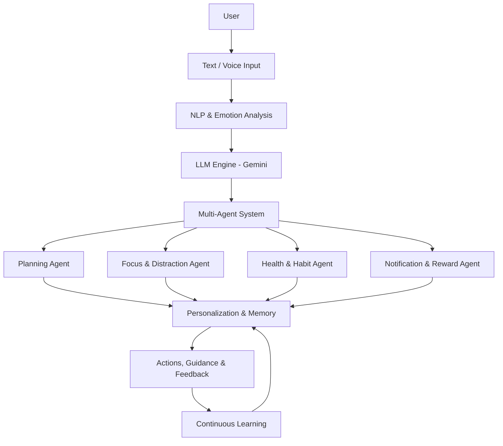

<h2><em>Comrade — Your AI Accountability Partner</em></h2>

🎯 Focus without burnout &nbsp;•&nbsp; 🗺️ Goals without confusion &nbsp;•&nbsp; ⚖️ Discipline without guilt

 

---

## 🎯 The Problem

> **Motivation exists. Consistency doesn't.**

Diwakar is a college student who struggles to study for 10 minutes  
—but can scroll reels for hours.

He wants success.  
He lacks **focus, structure, and sustainable execution**.

### ⚠️ Problems Faced

- 🚀 Productivity apps feel like rocket science  
- 🧭 Big dreams, zero roadmap, lost midway  
- 🔋 Week 1: Fully charged → Week 2: 3%  
- 🥗 Health sacrificed while chasing goals  

### 📊 Reality (Backed by Research)

- **53%** of students lose 5+ hours daily to doomscrolling  
- **92%** abandon goals due to lack of structure  
- **96 phone checks/day** during study sessions  

**This is not laziness — it's a system failure.**

---

## 💡 Introducing Comrade

**Comrade is a multi-agent AI mobile application powered by an LLM.**

It doesn't just track habits.  
It **understands behavior, designs roadmaps, and intervenes intelligently**.

### What Comrade Does

- Blocks distractions, allows only essentials  
- Converts goals into daily execution plans  
- Tracks progress visually and clearly  
- Supports health alongside productivity  

---

## 🎯 Comrade Goals

| 📈 Measure Growth | 🧠 Understand You | 🛡️ Protect Health | 🗺️ Build Roadmaps |
|:--:|:--:|:--:|:--:|
| Real progress | Behavior-aware AI | Burnout prevention | Clear daily plans |

---

## 👥 Target Audience

| 🎓 Students | 📚 Exam Aspirants | 🚀 Entrepreneurs | 💼 Professionals |
|:--:|:--:|:--:|:--:|
| Study consistency | Long prep cycles | Execution clarity | Balanced productivity |

---

## ✨ Core Features

### 🔹 Core Capabilities

- 🚫 Smart distraction blocking  
- 🗂️ Structured daily roadmaps  
- 📊 Real-time progress insights  
- 🔔 Timely focus interventions  

### 🔸 What Makes Comrade Different

- 🤖 LLM adapts to behavior daily  
- 🧠 Specialized AI agents (focus, health, planning)  
- ▶️ Distraction-free learning feeds  
- 🎙️ Natural voice & text interaction  

---

## 🔍 Opportunities & Differentiation

### Limitations of Existing Apps

**Mindful**
- Blocks alerts, not distractions  
- Doom scrolling still possible  

**Regain**
- Too complex to customize  
- Focus-only, ignores health  

### Feature Comparison

| Feature | Forest | Habitify | Comrade |
|---------|:------:|:--------:|:-------:|
| Focus mode | ✅ | ❌ | ✅ |
| Multi-agent AI | ❌ | ✅ | ✅ |
| Real-time distraction shield | ✅ | ❌ | ✅ |
| Personalized daily flow | ❌ | ✅ | ✅ |
| Voice interaction | ❌ | ✅ | ✅ |

**➡️ Comrade builds systems — not reminders.**

---

## 🌟 Impact & Benefits

- 🔥 Reduces digital distractions at the source  
- 🧠 Adapts continuously to user behavior  
- 🎯 Builds strong focus through routines  
- 💚 Encourages healthy daily habits  
- 🗺️ Converts goals into clear execution paths  

---

## 🚀 Future Vision

- 💻 **Cross-Platform Expansion** — desktop & laptop support  
- 🎓 **Personalized Career AI** — learning & career guidance  
- 🤝 **Peer Accountability** — community-driven focus  
- ⌚ **Smartwatch Integration** — sleep, activity, screen time  

---

## 🏗️ System Architecture

---

## 📧 Contact & Team

### Team: Pennywise ~ The Coding Clowns

 

#### 👤 Team Lead

**Harirajan S**  
📧 [230213.it@rmkec.ac.in](mailto:230213.it@rmkec.ac.in)

 

#### 👥 Team Members

**Harirajan S** (Leader) – [230213.it@rmkec.ac.in](mailto:230213.it@rmkec.ac.in)  
**Jaishree** – [230372.it@rmkec.ac.in](mailto:230372.it@rmkec.ac.in)  
**Jaisurya** – [230600.it@rmkec.ac.in](mailto:230600.it@rmkec.ac.in)  
**Dhanesh** – [230550.it@rmkec.ac.in](mailto:230550.it@rmkec.ac.in)

 

---

Made with ❤️ by Team Pennywise

