<h1>
  
</h1>

  <em>Focus without burnout • Goals without confusion • Discipline without guilt</em>

  

 

 

  <a href="#-demo"><b>🎥 Watch Demo</b></a> •
  <a href="#-download"><b>📱 Download APK</b></a> •
  <a href="#-features"><b>✨ Features</b></a> •
  <a href="#-architecture"><b>🏗️ Architecture</b></a> •
  <a href="#-contact"><b>📧 Contact</b></a>

 

---

 

## 🎯 The Problem We're Solving

### 💭 *Motivation exists. Consistency doesn't.*

 

<table>
<tr>
<td width="48%" valign="top">

### ⚠️ **Critical Challenges**

 

- 📱 **Infinite scrolling** & digital distractions dominate
- 🔧 **Overcomplicated** productivity tools that confuse
- 🗺️ **No clear execution plan** for daily progress
- 🔥 **Motivation burnout** within the first few weeks
- ⚖️ **Health sacrificed** in pursuit of productivity
- 🎯 **Goal abandonment** due to lack of structure

</td>
<td width="4%"></td>
<td width="48%" valign="top">

### 📊 **Validated Statistics**

 

🕐 **53%** lose 5+ hours daily to doomscrolling

📉 **92%** abandon goals without proper systems

📱 **96 unlocks/day** during critical work sessions

⏰ **3.5 hours** average attention fragmentation

🎓 **67%** of students report burnout

🔄 **81%** restart goals repeatedly without progress

</td>
</tr>
</table>

 

> ### 🧠 **This is not a discipline failure — it's a design failure in how we approach productivity.**

 

 

---

 

## 💡 Introducing Comrade

### 🤖 *Your AI-Powered Accountability Partner*

 

**Comrade is a next-generation Flutter mobile application that acts as your personal execution companion.**

Unlike traditional productivity apps, Comrade doesn't just track — it *understands, adapts, and intervenes intelligently.*

 

 

### 🔄 **The Paradigm Shift**

<table>
<tr>
<th width="45%">❌ Traditional Productivity Apps</th>
<th width="10%"></th>
<th width="45%">✅ Comrade Intelligence</th>
</tr>
<tr>
<td align="center">

📠Static to-do lists 
🚫 Harsh blanket app blockers 
📢 Constant motivation spam 
♻️ Repetitive burnout cycles 
📊 Generic advice for everyone 
🤖 One-size-fits-all automation

</td>
<td></td>
<td align="center">

🧠 Adaptive AI-generated roadmaps 
🯠Context-aware distraction control 
💬 Intelligent, timely nudges only 
🌱 Health-first sustainable systems 
🨠Personalized to your patterns 
🤝 Multi-agent collaborative AI

</td>
</tr>
</table>

 

---

 

## 🎯 Core Value Propositions

 

<table>
<tr>
<td align="center" width="25%">

<h3>📈 Measure Growth</h3>

<em>Track meaningful progress with intelligent analytics that show what actually matters</em>

</td>
<td align="center" width="25%">

<h3>🧠 Understand You</h3>

<em>AI learns your focus patterns, energy cycles, and personal productivity rhythms</em>

</td>
<td align="center" width="25%">

<h3>🛡️ Protect Health</h3>

<em>Prevent burnout with proactive rest recommendations and sustainable pacing</em>

</td>
<td align="center" width="25%">

<h3>🗺️ Build Roadmaps</h3>

<em>Generate daily actionable plans that break down ambitious goals into achievable steps</em>

</td>
</tr>
</table>

 

 

---

 

## 👥 Who Benefits from Comrade?

 

<table>
<tr>
<td align="center" width="25%">

<h3>🎓 Students</h3>

Build consistent study habits without burnout. Master time management and achieve academic excellence sustainably.

</td>
<td align="center" width="25%">

<h3>📚 Exam Aspirants</h3>

Stress-free preparation with AI-optimized schedules. Stay on track through long preparation journeys.

</td>
<td align="center" width="25%">

<h3>🚀 Entrepreneurs</h3>

Transform vision into execution. Daily clarity on priorities with health-conscious productivity systems.

</td>
<td align="center" width="25%">

<h3>💼 Professionals</h3>

Balanced productivity that protects work-life harmony. Achieve career goals without sacrificing wellbeing.

</td>
</tr>
</table>

 

---

 

## ✨ What Makes Comrade Revolutionary

 

<table>
<tr>
<td width="48%" valign="top">

### 🧠 **AI-Driven Personalization**

 

- 🎯 **LLM-generated daily schedules** tailored to your goals
- 📊 **Learns attention & motivation cycles** over time
- 🔄 **Adapts goals in real-time** based on performance
- 💡 **Context-aware recommendations** that evolve with you
- 🎨 **Personality-matched interactions** for maximum engagement
- 📈 **Predictive planning** that anticipates your needs

 

### 🚫 **Intelligent Distraction Control**

 

- 🛡️ **Smart app blocking** during focus sessions
- 📢 **Priority-only notifications** that matter
- 🧘 **Context-aware focus modes** adaptive to tasks
- ⏰ **Gentle interruption management** not harsh blocks
- 🎯 **Distraction pattern analysis** with insights
- 🔔 **Scheduled digital wellness** reminders

</td>
<td width="4%"></td>
<td width="48%" valign="top">

### 💪 **Health-First Productivity**

 

- 🌿 **Proactive break encouragement** based on workload
- 😴 **Sleep protection** with evening wind-down
- 🏃 **Movement reminders** integrated naturally
- 🧠 **Burnout detection** with early intervention
- ⚖️ **Sustainable habit building** over quick wins
- 💚 **Mental health check-ins** with empathy

 

### 🤖 **Multi-Agent AI Architecture**

 

- 📋 **Planning Agent** – intelligent task breakdown
- 🎯 **Focus Agent** – real-time distraction handling
- 🏥 **Health Agent** – burnout prevention system
- 🎉 **Motivation Agent** – perfectly timed encouragement
- 🔄 **Coordination Layer** – seamless agent collaboration
- 📊 **Learning Engine** – continuous improvement from behavior

</td>
</tr>
</table>

 

 

---

 

## 🏗️ System Architecture

### 🔬 *Advanced Multi-Agent Intelligence System*

```mermaid
graph TB
    subgraph User Interface
        U[👤 User]
        I[💬 Text/Voice Input]
    end

    subgraph Input Processing
        NLP[🧠 NLP & Emotion Analysis]
        CONTEXT[📊 Context Extraction]
    end

    subgraph AI Core
        LLM[⚡ LLM Engine - Gemini]
        MAS[🤖 Multi-Agent Orchestrator]
    end

    subgraph Specialized Agents
        A1[📋 Planning Agent<br/>Task Breakdown & Scheduling]
        A2[🎯 Focus & Distraction Agent<br/>Attention Management]
        A3[💚 Health & Habit Agent<br/>Wellbeing Guardian]
        A4[🎉 Notification & Reward Agent<br/>Motivation System]
    end

    subgraph Intelligence Layer
        PER[🧬 Personalization Engine<br/>Pattern Learning & Memory]
        PRED[🔮 Predictive Analytics<br/>Behavior Forecasting]
    end

    subgraph Action Layer
        OUT[⚡ Actions, Guidance & Feedback]
        INT[🔔 Smart Interventions]
    end

    subgraph Learning Loop
        LEARN[📈 Continuous Learning<br/>Model Refinement]
        FB[💬 User Feedback Integration]
    end

    %% Flow connections
    U --> I
    I --> NLP
    I --> CONTEXT
    NLP --> LLM
    CONTEXT --> LLM
    LLM --> MAS

    MAS --> A1
    MAS --> A2
    MAS --> A3
    MAS --> A4

    A1 --> PER
    A2 --> PER
    A3 --> PER
    A4 --> PER

    PER --> PRED
    PRED --> OUT
    OUT --> INT
    INT --> U

    OUT --> LEARN
    INT --> FB
    FB --> LEARN
    LEARN --> PER
    LEARN --> MAS

    style U fill:#22C55E,stroke:#16A34A,stroke-width:3px,color:#fff
    style LLM fill:#8E75B2,stroke:#6D28D9,stroke-width:3px,color:#fff
    style MAS fill:#3B82F6,stroke:#2563EB,stroke-width:3px,color:#fff
    style PER fill:#F59E0B,stroke:#D97706,stroke-width:3px,color:#fff
    style LEARN fill:#EC4899,stroke:#DB2777,stroke-width:3px,color:#fff
```

 

 

### 🔄 **Intelligence Flow**

**Input Processing** → **AI Analysis** → **Agent Coordination** → **Personalized Action** → **Continuous Learning**

 

---

 

## 🎨 Key Features Showcase

<table>
<tr>
<td align="center" width="33%">

### 📱 **Smart Dashboard**

Real-time progress tracking 
AI-generated insights 
Motivation score monitoring 
Health status indicators

</td>
<td align="center" width="33%">

### 🎯 **Focus Mode**

Adaptive app blocking 
Distraction intervention 
Deep work sessions 
Pomodoro integration

</td>
<td align="center" width="33%">

### 🗓️ **AI Planning**

Daily roadmap generation 
Smart task prioritization 
Energy-aware scheduling 
Goal decomposition

</td>
</tr>
<tr>
<td align="center" width="33%">

### 💬 **AI Companion**

Natural conversations 
Emotional support 
Accountability check-ins 
Motivational guidance

</td>
<td align="center" width="33%">

### 📊 **Analytics**

Productivity patterns 
Focus time analysis 
Goal achievement rates 
Health metrics tracking

</td>
<td align="center" width="33%">

### 🏆 **Rewards System**

Achievement milestones 
Streak maintenance 
Progress celebrations 
Gamification elements

</td>
</tr>
</table>

 

 

---

 

## 🚀 Technology Stack

<table>
<tr>
<td align="center" width="20%">

 <b>Flutter</b> 
<em>UI Framework</em>
</td>
<td align="center" width="20%">

 <b>Dart</b> 
<em>Programming</em>
</td>
<td align="center" width="20%">

 <b>Gemini AI</b> 
<em>LLM Engine</em>
</td>
<td align="center" width="20%">

 <b>Firebase</b> 
<em>Backend</em>
</td>
<td align="center" width="20%">

 <b>SQLite</b> 
<em>Local Storage</em>
</td>
</tr>
</table>

 

---

 

## 📥 Getting Started

### 🎯 *Ready to Transform Your Productivity?*

 

<table>
<tr>
<td align="center" width="33%">

### **1️⃣ Download**

Download the APK from our releases page

</td>
<td align="center" width="33%">

### **2️⃣ Install**

Enable installation from unknown sources

</td>
<td align="center" width="33%">

### **3️⃣ Start**

Set your goals and let Comrade guide you

</td>
</tr>
</table>

 

 

---

 

## 🎯 Roadmap

 

### **Phase 1: Foundation** ✅
- [x] Core AI architecture
- [x] Multi-agent system
- [x] Basic UI/UX
- [x] Focus mode implementation

 

### **Phase 2: Enhancement** 🚧
- [ ] Advanced analytics dashboard
- [ ] Voice interaction system
- [ ] Cross-platform sync
- [ ] Community features

 

### **Phase 3: Scale** 📅
- [ ] iOS version
- [ ] Web dashboard
- [ ] API for integrations
- [ ] Team collaboration features

 

 

---

 

## 📄 License

This project is licensed under the **MIT License** - see the [LICENSE](LICENSE) file for details.

 

 

---

 

## 📧 Contact

### 💌 *We'd Love to Hear From You!*

 

<table>
<tr>
<td align="center">

**📧 Email** 
[comrade.app@email.com](mailto:comrade.app@email.com)

</td>
<td align="center">

**🦠Twitter** 
[@ComradeApp](#)

</td>
<td align="center">

**💼 LinkedIn** 
[Comrade Team](#)

</td>
</tr>
</table>

 

 

---

 

  

### 🌟 **Built with ❤️ for Those Who Dare to Execute**

 

**Comrade** • *Your AI Partner in Discipline*

 

  

*© 2024 Comrade. Transforming intentions into achievements, one day at a time.*

 

